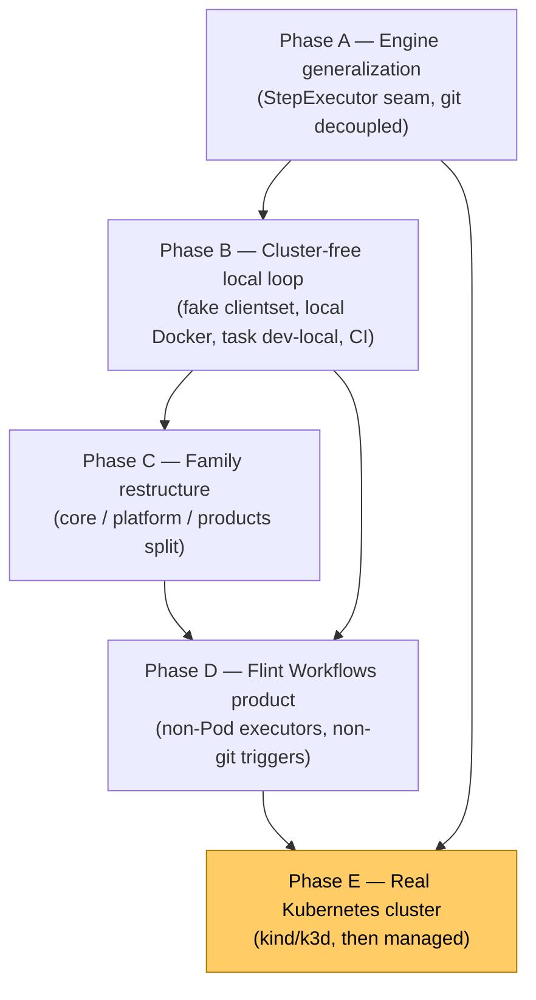

# Flint Family Execution Roadmap

## Overview

This is the execution roadmap for the direction set out in
[`flint-family-architecture.md`](./flint-family-architecture.md): moving Flint from a single CI
product to a **family** (Flint CI, Flint Workflows, Flint Load Testing) on a shared durable engine
and platform. Where the architecture doc explains *what* the family is and *why*, this doc is the
ordered *how* — the phases, their dependencies, the files they touch, and how each is verified.

The sequencing reflects a deliberate constraint: **codebase changes first, a way to run and test
everything locally without Kubernetes second, and a real cluster only at the very end.** Nothing
depends on a cluster until the final phase.

The validating milestone is a minimal **Flint Workflows** product. If a second product can be built
on the engine with no changes to the engine itself, the generalization is real — the engine is a
durable DAG executor, not "a CI engine wearing a generic name."

## The through-line

The engine has exactly one way to execute a step today: create a Kubernetes Job
(`internal/engine/dispatch.go`). Putting a `StepExecutor` interface at that seam is the single
highest-leverage move in the whole roadmap. One abstraction does three jobs at once:

1. **Proves the seam generalizes** — the K8s logic becomes one implementation among several.
2. **Yields a local executor** for cluster-free dev and test (subprocess, then local Docker).
3. **Defers the real-cluster spend** to the end — everything up to Phase E runs on a laptop.

Flint Workflows later registers **non-Pod executors** (`http`, `approval`), which prove the seam
isn't merely "container vs. container" — it is genuinely execution-model-agnostic.

## Phase dependency map



Phase D depends on both C (the product seams) and B (the local loop it is demoed on). Phase E is the
gate: it is the *only* phase that requires a cluster, and it comes last.

## Current-state audit

Findings from a deep read of the codebase, with anchors verified against the cited code.

- **K8s client is `kubernetes.Interface`** (`cmd/worker/main.go:128`), already nil-safe: with no
  cluster the worker runs in "DB-only mode" and steps stay queued (`internal/engine/loop.go:148`
  guards dispatch on a non-nil client). Fully fakeable via `k8s.io/client-go/kubernetes/fake`.
- **Dispatch seam** lives in `internal/engine/dispatch.go`: `dispatchStep` switches on `exec_type`,
  and `dispatchRunStep` builds the Job and calls `k8s.BatchV1().Jobs(ns).Create(...)`. Generic
  resolution (image / pool / env / secret) precedes the K8s-only construction — a clean cut point.
- **Completion is transport-universal**: a running step reports via `POST /internal/complete` with
  an HMAC task token (`internal/agent/complete.go` → server → `PgEngine.CompleteStep`). The call is
  idempotent; an informer is the crash fallback (`internal/worker/informer/`). **Any executor can
  reuse this exact callback.**
- **Git is welded into the engine**: `StartWorkflowInput` carries typed `Repo`/`Ref`/`CommitSHA`/
  `TriggerType` fields, and the expression context hardcodes `git.*` (`internal/engine/advance.go:360`).
- **The agent is pod-coupled**: env-var-only config, hardcoded `/workspace`, sidecar model. Not
  runnable as a local step today (the local executor bypasses it rather than porting it).
- **Tests**: `task test` is `go test ./...`; integration tests skip unless `FLINT_TEST_DSN` is set.
  `docker-compose.yml` provides Postgres 17. There are no testcontainers, no fake-k8s tests, and no
  `.github/workflows` CI today.
- **Frontend**: a single TanStack Start app under `web/`, an oRPC API layer with a mock-data
  fallback, and a reusable shell (`web/src/routes/__root.tsx`, `web/src/components/Sidebar.tsx`) with
  hardcoded nav. The DAG view is reusable: `web/src/components/pipeline/dag-view.tsx`.
- **Server routing**: routes are registered through a single `registerAPIRoutes()`
  (`internal/server/routes.go:75`) — **not yet split** into platform vs. CI groups. A `Mode` flag
  does exist and is read in `registerRoutes()` (`internal/server/server.go:74`).

## Decisions locked

- **The local executor is tiered.** A trivial **subprocess** executor (`noop`/`echo`, runs in CI,
  no daemon) validates the `StepExecutor` interface in Phase A; a **local Docker** executor
  (`docker run <image> sh -c <cmd>`) gives faithful end-to-end local runs in Phase B.
- **Scope is the full direction**: engine generalization → cluster-free local loop → family
  restructure → a minimal Flint Workflows product → real cluster last.
- **Unified shell, distinct product apps, products independently installable** — the cloud-console
  model, per the architecture doc. The shell renders only the products that are deployed.

## Phase A — Engine generalization

Four reviewable PRs, **order 1 → 3 → 2 → 4**. Each PR keeps the existing CI test suite green with
**zero behavior change for CI** — the engine is the scariest (durability) code, so changes stay
small and independently revertable.

- **PR1 — Neutralize `StartWorkflowInput`.** Replace the typed git fields with a generic
  `Inputs map[string]any` (CI populates a `git` namespace + `trigger`); point the expression context
  at the map instead of hardcoded `git.*`. Add a `kind` discriminator for run type. Files:
  `internal/engine/{engine,advance,pg_engine,loop}.go`.
- **PR3 — `forge.ForgeProvider` → narrow `FileGetter`.** The engine only needs
  `GetFile(ctx, ref, path)`. Forge (webhooks, commit status, clone URLs) stays in the CI product.
  Files: `internal/engine/{resolve,pg_engine}.go`. Trivial and zero-risk, so it lands before the
  risky executor refactor.
- **PR2 — `StepExecutor` interface + registry (the linchpin).**
  ```go
  type StepExecutor interface {
      Kind() string
      Dispatch(ctx context.Context, spec StepExecutionSpec) (handle string, err error)
      Cancel(ctx context.Context, handle string) error
  }
  ```
  The existing Job-construction logic becomes the registered `k8s` executor (no behavior change).
  **Ship with the subprocess executor** as a second, non-K8s implementation so the interface is
  validated against a genuinely different backend, not a CI-shaped guess. Generic pre-work and
  `StepExecutionSpec` assembly stay in the engine; the loop holds an executor and calls `Dispatch`.
  Workspace setup moves into each executor. Files: split `dispatch.go` into
  `executor.go` + `executor_k8s.go` + `executor_local.go`; `loop.go`; `cmd/worker/main.go` (select
  executor by config).
- **PR4 — Move triggers out of the engine.** Triggers become a product concern that calls
  `StartWorkflow`. CI's webhook handling, push/PR/tag matching, and commit-status reporting stay in
  the CI product. Mostly a code-move.

**Milestone:** `internal/engine/` is a generic durable DAG executor; CI is a consumer of it.

**Verification:** per PR, `task check` is green and engine unit + integration tests pass unchanged;
B1 (below) asserts the produced CI Job spec is byte-for-byte unchanged.

## Phase B — Cluster-free local dev & test loop

Two complementary tracks, both requiring **no Kubernetes**.

- **B1 — Fake-clientset dispatch tests.** Inject `k8s.io/client-go/kubernetes/fake` into the K8s
  executor and assert the produced Job spec (containers, env, labels, volumes, resources). Covers
  the dispatch path that is currently 0% tested without a cluster. File:
  `internal/engine/executor_k8s_test.go`.
- **B2 — Local Docker executor (the real cluster-free loop).** Upgrade the subprocess executor from
  PR2 to a Docker backend: `docker run <step.image> sh -c <cmd>` on a bind-mounted tmpdir workspace,
  then call `/internal/complete` with the task token — no pod, no sidecar, no informer. Extract the
  HTTP-callback helper from `internal/agent/complete.go` so the agent and the local executor share
  it. Gives a true end-to-end run on a laptop.
- **B3 — Postgres for tests in one command.** Add a `testcontainers-go` Postgres fixture (or a
  `task test-db-up` helper that boots the compose Postgres and exports `FLINT_TEST_DSN`). Files:
  `internal/dbkit/` test helper, `Taskfile.yml`.
- **B4 — `task dev-local`.** Boots Postgres + migrations, starts server + worker with the **local
  executor** selected via config (`executor: k8s | local`), and optionally the web dev server. A
  developer triggers a run and watches it execute locally. Files: `Taskfile.yml`,
  `config.local.yaml`, `internal/config`.
- **B5 — GitHub Actions CI.** Add `.github/workflows/ci.yml`: `task check` plus the fake-clientset
  and local-executor tests, with a Postgres service container. Closes the "no automated CI" gap.

**Verification:** `task test` passes with no cluster; `task dev-local` runs a sample CI pipeline
laptop-only to `succeeded` via the local Docker executor; the CI workflow is green on a PR.

## Phase C — Family restructure (seams, no second product yet)

Establish the boundaries from the architecture doc without building a second product.

- **Backend layout**: `internal/core` (engine, dbkit, db, runner, agent, secret, logsink, outbox),
  `internal/platform` (auth, rbac, orgs, audit, config, server scaffolding), and
  `internal/products/ci` (pipeline, forge, webhooks, Pipeline CRD). Enforce the one rule that keeps
  extraction cheap: **`products/* never import each other`**.
- **Server**: split the single `registerAPIRoutes()` into `registerPlatformRoutes()` /
  `registerCIRoutes()`, gated by a `products` config block. Webhook handling becomes a per-product
  registration.
- **Frontend**: extract the shell into `web/src/shell` (config-driven nav, product switcher) and move
  CI routes under a `ci` product module. The shell renders only enabled products.

**Verification:** CI still works fully; the `products` config can disable CI routes/nav; a
lint/`go list` check confirms there are no cross-product imports.

## Phase D — Flint Workflows product (the validating second surface)

This proves the generalization is real: it exercises non-git triggers and **non-Pod step types** on
the shared engine and platform.

- **Definition schema** under `internal/products/workflows`: a non-CI YAML (nodes, `dependsOn`,
  inputs, triggers). Reuse the generic `pkg/pipeline` DAG resolver, expression engine, and validator;
  do **not** reuse CI triggers or forge.
- **New executors registered against the generic engine** (the proof the seam is not
  container-shaped):
  - `http` / `grpc` — call an endpoint; runs in-engine / as a process, **no Pod**. Proves an
    executor needn't create a Job.
  - `approval` — a thin wrapper over the existing gates + signals.
  - `subworkflow` — over the existing child-workflow support.
  - `container` — reuses the K8s / local executor from Phase A for arbitrary command steps.
- **Triggers**: manual API + cron `schedule` + a generic `webhook` (no forge). Reuse the engine's
  durable timers for schedules.
- **Persistence**: reuse `workflows` / `steps` / `timers` / `signals` with the `kind` discriminator
  from PR1; add a workflow-definition table if needed. A `Workflow` CRD is optional for the MVP
  (API/DB-driven first).
- **Server**: `registerWorkflowRoutes()` gated by `products.workflows.enabled`.
- **Frontend**: a Workflows product app mounted in the shared shell — definition list, run detail
  (reuse `web/src/components/pipeline/dag-view.tsx`), manual-trigger UI. Same login, org, RBAC, and
  runner pools as CI.
- **Local-first**: everything above must run under `task dev-local` with the local executor — no
  cluster needed to demo Workflows.

**Milestone:** two distinct products (CI + Workflows) share one engine, platform, and shell; a
Workflow runs locally end-to-end via the local executor.

**Verification:** a Workflow combining `http` + `approval` + `container` steps with a manual trigger
runs to `succeeded` under `task dev-local`, with no git/forge involvement; both products are visible
in the shell under one login.

## Phase E — Real Kubernetes cluster (last)

Only once A–D are solid locally. Stand up a local cluster first (kind or k3d), deploy
server / worker / controller, run **both** a CI pipeline and a Workflow against the **k8s executor**,
and validate Job dispatch, the informer fallback, and the workspace modes end to end. Then graduate
to a managed cluster.

Deferred decisions, to be settled at the start of this phase, not now: kind vs. k3d for local; which
managed provider.

**Verification:** a CI pipeline and a Workflow both run on kind, complete via the callback, and the
informer correctly recovers a deliberately killed step pod.

## Risks & sequencing notes

- This is the largest-scope option. Value lands incrementally and earlier phases de-risk later ones —
  the engine and local loop must be rock-solid before the product build. **Do not start Phase D
  before Phase B is green.**
- Keep CI byte-for-byte unchanged through Phase A; B1 is the guardrail that enforces it.
- Don't over-fit `StepExecutor` to containers. The `http` and `approval` executors in Phase D are the
  proof it generalizes; sanity-check the interface against them while designing PR2.
- The agent's pod-coupling is intentionally **not** refactored away. The local executor bypasses the
  agent rather than porting it; revisit only if a local agent mode is later wanted.
